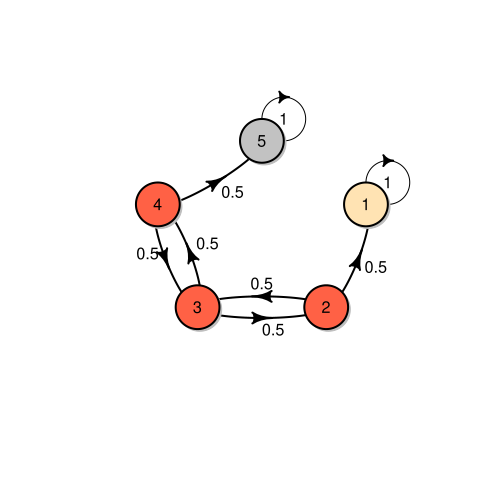

# graduate-dissertation
Mathematics and Physics' master's degree dissertation on discrete time homogeneous Markov chains.

Markov chains are a mathematical area which encompasses, to name a few, probability, inference, linear
algebra, gaphs or algorithms theory (since discrete markov chains can be simulated in a computer). All of
the aforementioned conditions make them an interesting study from both the mathematical and computer science
viewpoint. This work constitutes a review of theoretical concepts and improvements for
[markovchain](https://github.com/spedygiorgio/markovchain) package based on that review.

<p align="center">
  
</p>

## Configuration for Org mode
In Emacs, we should have something like this in its configuration file to be able to
compile the Org's document:

```
(require 'ox-latex)
(with-eval-after-load "ox-latex"
  (add-to-list 'org-latex-classes
               '("scrreprt" "\\documentclass{scrreprt}"
                 ("\\chapter{%s}" . "\\chapter*{%s}")
                 ("\\section{%s}" . "\\section*{%s}")
                 ("\\subsection{%s}" . "\\subsection*{%s}")
                 ("\\subsubsection{%s}" . "\\subsubsection*{%s}")
                 ("\\paragraph{%s}" . "\\paragraph*{%s}"))))
```
